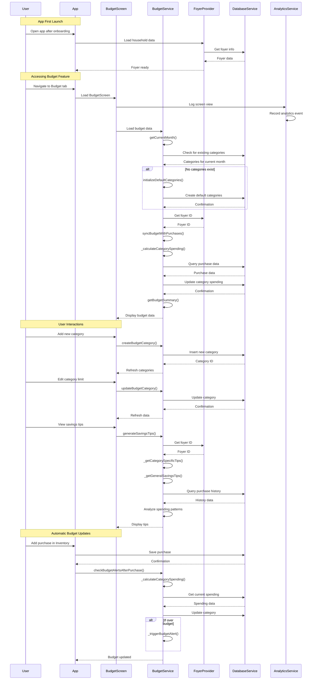

# Budget Feature Flow Analysis

## Overview
This document details the complete flow of the budget feature in NgoNest, from app installation to budget management and savings recommendations.

## Complete User Flow: Budget Feature

## Key Implementation Points

1. **Automatic Initialization**: Default budget categories are created automatically if none exist
2. **Real-time Sync**: Budgets are automatically updated when purchases are made
3. **Intelligent Recommendations**: Savings tips are generated based on spending patterns
4. **Historical Analysis**: Users can view spending history and trends
5. **Analytics Integration**: User actions are tracked for analytics purposes

## Potential Gaps in Implementation

1. **Connection with Inventory**: The automatic connection between inventory purchases and budget updates may not be fully implemented
2. **Budget Alerts**: Real-time budget alert notifications to users may be missing
3. **Recommended Budgets**: Initialization of recommended budgets based on household profile may not be fully integrated
4. **Analytics Events**: Proper linking of all analytics events to user actions may be incomplete
5. **Error Handling**: Comprehensive error handling for edge cases may be missing