# Flow Complet de Synchronisation - NgoNest

## Vue d'ensemble améliorée

Cette version corrige et complète le flow de synchronisation en intégrant :
1. **Authentification optionnelle** pendant l'onboarding
2. **Import depuis le cloud** si des données existent
3. **Sync bidirectionnelle automatique** quand la connexion revient
4. **Gestion dans les paramètres** pour activer/désactiver

---

## Flow Complet : Installation → Onboarding → Usage

```mermaid
sequenceDiagram
    participant U as User
    participant A as App
    participant OB as OnboardingScreen
    participant AS as AuthService
    participant SS as SyncService
    participant BSS as BidirectionalSyncService
    participant CS as ConnectivityService
    participant DB as DatabaseService (Local)
    participant SAPI as SupabaseApiService (Cloud)

    Note over U,A: 📲 Installation & Premier Lancement
    U->>A: Installer et ouvrir l'app
    A->>A: Initialiser services
    A->>CS: Vérifier connectivité
    CS-->>A: État réseau
    
    Note over U,OB: 👤 Onboarding - Création Profil
    U->>OB: Remplir informations foyer
    OB->>OB: Valider données
    
    Note over U,OB: 🔐 Proposition Authentification (Optionnelle)
    OB->>U: "Voulez-vous synchroniser vos données?"
    alt Utilisateur accepte la sync
        U->>OB: Accepter synchronisation
        OB->>AS: Demander authentification
        AS->>SAPI: Email/Password ou OAuth
        SAPI-->>AS: Session créée
        AS-->>OB: Authentification réussie
        
        Note over OB,SAPI: ☁️ Vérifier données cloud existantes
        OB->>SAPI: Vérifier données existantes pour user
        SAPI-->>OB: État données cloud
        
        alt Données cloud existent
            OB->>U: "Importer données du cloud?"
            U->>OB: Confirmer import
            OB->>SAPI: Récupérer toutes les données
            SAPI-->>OB: Foyer, Objets, Budgets, etc.
            OB->>DB: Sauvegarder localement
            DB-->>OB: Données importées
        else Pas de données cloud
            OB->>DB: Créer profil local
            DB-->>OB: Profil créé
            OB->>SS: Enqueue création foyer
            SS->>SAPI: Sync initiale vers cloud
            SAPI-->>SS: Confirmé
        end
        
        OB->>SS: enableSync(userConsent: true)
        OB->>BSS: enableBidirectionalSync()
        BSS-->>OB: Sync bidirectionnelle active
        
    else Utilisateur refuse/skip
        U->>OB: "Travailler en local uniquement"
        OB->>DB: Créer profil local uniquement
        DB-->>OB: Profil créé
        OB->>SS: Sync reste désactivée
        Note over OB: L'utilisateur peut activer sync plus tard
    end
    
    OB-->>A: Onboarding terminé
    A->>A: Naviguer vers Dashboard

    Note over U,A: 📝 Usage Normal - Opérations CRUD
    U->>A: Ajouter/Modifier/Supprimer objet
    A->>DB: Appliquer changement LOCAL FIRST
    DB-->>A: Confirmé
    
    alt Sync activée
        A->>SS: enqueueOperation(type, entity, payload)
        SS->>DB: Stocker dans sync_outbox
        
        alt Connexion disponible
            SS->>SS: Auto-sync déclenché
            SS->>SAPI: Envoyer opération
            SAPI->>SAPI: Traiter selon entity_type
            SAPI-->>SS: Succès
            SS->>DB: Marquer comme synced
        else Hors ligne
            SS->>DB: Rester en pending
            Note over SS: Retry automatique quand connexion revient
        end
    else Sync désactivée
        Note over A: Opération reste uniquement locale
    end

    Note over U,A: 🌐 Reconnexion Automatique
    CS->>CS: Détecte connexion revenue
    CS->>SS: Notifier connexion online
    
    alt Sync activée
        SS->>SS: backgroundSync()
        SS->>DB: Récupérer pending operations
        DB-->>SS: Liste opérations
        
        loop Pour chaque opération
            SS->>SAPI: syncOperation()
            SAPI-->>SS: Réponse
            alt Succès
                SS->>DB: Marquer synced
            else Échec
                SS->>DB: Incrémenter retry_count
            end
        end
        
        Note over SS,BSS: 🔁 Sync Bidirectionnelle
        SS->>BSS: Déclencher sync bidirectionnelle
        BSS->>SAPI: getLatestChanges(since: lastSync)
        SAPI-->>BSS: Changements depuis le cloud
        
        loop Pour chaque changement cloud
            BSS->>DB: Vérifier conflit avec local
            alt Conflit détecté
                BSS->>BSS: Résoudre selon stratégie
                Note over BSS: lastModifiedWins, localWins, ou cloudWins
            else Pas de conflit
                BSS->>DB: Appliquer changement cloud
            end
        end
        
        BSS-->>SS: Sync bidirectionnelle terminée
    end

    Note over U,A: ⚙️ Gestion dans Paramètres
    U->>A: Ouvrir Settings
    A->>A: Afficher SettingsScreen
    
    alt Activer sync (était désactivée)
        U->>A: Toggle "Synchronisation Cloud"
        
        alt Pas encore authentifié
            A->>AS: Vérifier session
            AS-->>A: Aucune session
            A->>U: Rediriger vers écran Auth
            U->>AS: S'authentifier
            AS->>SAPI: Créer session
            SAPI-->>AS: Session créée
            AS-->>A: Authentification OK
            
            A->>SAPI: Vérifier données cloud
            SAPI-->>A: État données
            
            alt Données cloud existent
                A->>U: Proposer import
                U->>A: Confirmer
                A->>SAPI: Importer données
                SAPI-->>DB: Données cloud → local
            end
        else Déjà authentifié
            A->>SS: enableSync(userConsent: true)
            SS->>SS: Déclencher sync initiale
        end
        
        A->>BSS: enableBidirectionalSync()
        BSS->>BSS: Configurer listeners real-time
        BSS-->>A: Sync activée
        
    else Désactiver sync
        U->>A: Toggle OFF "Synchronisation Cloud"
        A->>SS: disableSync()
        A->>BSS: disableBidirectionalSync()
        BSS->>BSS: Arrêter listeners
        Note over A: Données locales conservées
        A->>U: "Sync désactivée - données locales OK"
    end
```



---

## Composants Clés du Système

### 1. AuthService (Nouveau rôle clarifié)
```dart
class AuthService {
  // Authentification utilisateur
  Future<bool> signIn({email, password});
  Future<bool> signUp({email, password, userData});
  
  // État de session
  bool get isAuthenticated;
  User? get currentUser;
  
  // Déconnexion
  Future<void> signOut();
}
```

### 2. SyncService (Unidirectionnel local → cloud)
```dart
class SyncService {
  // Activation/désactivation
  Future<void> enableSync({required bool userConsent});
  Future<void> disableSync();
  
  // Enregistrement opérations
  Future<void> enqueueOperation({
    String operationType, // CREATE, UPDATE, DELETE
    String entityType,
    int entityId,
    Map<String, dynamic> payload,
  });
  
  // Sync automatique
  Future<void> backgroundSync();
  
  // États
  bool get syncEnabled;
  bool get isSyncing;
  int get pendingOperations;
}
```

### 3. BidirectionalSyncService (Cloud → local)
```dart
class BidirectionalSyncService {
  // Activation sync bidirectionnelle
  Future<void> enableBidirectionalSync();
  Future<void> disableBidirectionalSync();
  
  // Récupération changements cloud
  Future<void> pullFromCloud();
  
  // Résolution conflits
  Future<void> resolveConflicts();
  
  // Listeners real-time (Supabase Realtime)
  void setupRealtimeListeners();
  
  // États
  bool get isBidirectionalSyncEnabled;
  int get resolvedConflicts;
}
```

### 4. SupabaseApiService (Interface cloud)
```dart
class SupabaseApiService {
  // Sync opérations
  Future<void> syncOperation(Map<String, dynamic> operation);
  
  // Récupération données
  Future<List<Map<String, dynamic>>> getLatestChanges({
    required String entityType,
    required DateTime since,
  });
  
  // Import données cloud
  Future<Map<String, dynamic>> importUserData(String userId);
  
  // Test connexion
  Future<bool> testConnection();
}
```

---

## Gaps Identifiés et Corrections Nécessaires

### 🚧 Gap 1: Authentification pendant Onboarding
**Manque**: Pas de proposition d'authentification à la fin de l'onboarding

**Solution**:
```dart
// code/flutter/ngonnest_app/lib/screens/onboarding_screen.dart

// Après création du profil foyer
Future<void> _completeOnboarding() async {
  // Sauvegarder profil local d'abord
  await _saveFoyerProfile();
  
  // Proposer sync optionnelle
  final wantsSync = await _showSyncDialog();
  
  if (wantsSync) {
    // Rediriger vers authentification
    final authenticated = await Navigator.push(
      context,
      MaterialPageRoute(builder: (_) => AuthScreen()),
    );
    
    if (authenticated) {
      // Vérifier données cloud
      final cloudData = await SupabaseApiService.instance
          .importUserData(AuthService.instance.currentUser!.id);
      
      if (cloudData.isNotEmpty) {
        final shouldImport = await _showImportDialog();
        if (shouldImport) {
          await _importCloudData(cloudData);
        }
      }
      
      // Activer sync
      await SyncService().enableSync(userConsent: true);
      await BidirectionalSyncService.instance.enableBidirectionalSync();
    }
  }
  
  // Naviguer vers dashboard
  Navigator.pushReplacementNamed(context, '/dashboard');
}
```

### 🚧 Gap 2: Import données cloud
**Manque**: Aucune logique pour importer depuis le cloud si données existent

**Solution**:
```dart
// code/flutter/ngonnest_app/lib/services/sync_service.dart

Future<void> importFromCloud(String userId) async {
  try {
    // Récupérer toutes les données utilisateur
    final cloudData = await SupabaseApiService.instance
        .importUserData(userId);
    
    final db = await DatabaseService().database;
    
    // Importer foyer
    if (cloudData['foyer'] != null) {
      await db.insert('foyer', cloudData['foyer']);
    }
    
    // Importer objets
    for (final objet in cloudData['objets'] ?? []) {
      await db.insert('objet', objet);
    }
    
    // Importer budgets
    for (final budget in cloudData['budgets'] ?? []) {
      await db.insert('budget_categories', budget);
    }
    
    // Importer achats
    for (final achat in cloudData['achats'] ?? []) {
      await db.insert('reachat_log', achat);
    }
    
    ConsoleLogger.success('[SyncService] Import cloud terminé');
  } catch (e, stackTrace) {
    await ErrorLoggerService.logError(
      component: 'SyncService',
      operation: 'importFromCloud',
      error: e,
      stackTrace: stackTrace,
      severity: ErrorSeverity.high,
    );
    rethrow;
  }
}
```

### 🚧 Gap 3: Activation dans Settings avec Auth
**Manque**: Si pas authentifié, pas de redirection vers l'écran d'auth

**Solution**:
```dart
// code/flutter/ngonnest_app/lib/screens/settings_screen.dart

Future<void> _toggleSync(bool value) async {
  if (value) {
    // Activer sync
    
    if (!AuthService.instance.isAuthenticated) {
      // Rediriger vers authentification
      final authenticated = await Navigator.push(
        context,
        MaterialPageRoute(builder: (_) => AuthScreen()),
      );
      
      if (!authenticated) {
        // Annuler si pas authentifié
        setState(() => _syncEnabled = false);
        return;
      }
      
      // Vérifier données cloud existantes
      final cloudData = await SupabaseApiService.instance
          .importUserData(AuthService.instance.currentUser!.id);
          
      if (cloudData.isNotEmpty) {
        final shouldImport = await _showImportDialog();
        if (shouldImport) {
          await SyncService().importFromCloud(
            AuthService.instance.currentUser!.id
          );
        }
      }
    }
    
    // Activer sync avec consentement
    await SyncService().enableSync(userConsent: true);
    await BidirectionalSyncService.instance.enableBidirectionalSync();
    
  } else {
    // Désactiver sync
    await SyncService().disableSync();
    await BidirectionalSyncService.instance.disableBidirectionalSync();
  }
  
  setState(() => _syncEnabled = value);
}
```

---

## Stratégies de Résolution de Conflits

### 🔄 Conflits Données Bidirectionnelles

1. **Local Wins** (par défaut pour modifications utilisateur)
   - Les modifications locales ont priorité
   - Utilisé pour CREATE/UPDATE par utilisateur

2. **Cloud Wins** (pour modifications externes)
   - Les modifications cloud ont priorité
   - Utilisé pour sync partage familial

3. **Last Modified Wins** (pour données complexes)
   - Comparaison des timestamps
   - Fusion intelligente si possible

### 📊 Exemples de Conflits

| Scénario | Résolution | Raison |
|----------|------------|--------|
| Modification même objet local/cloud | Last Modified Wins | Plus récent a priorité |
| Suppression local mais modifié cloud | Cloud Wins + Notification | Donnée importante restaurée |
| Création local mais existe cloud | Local Wins + Renommage | Pas de perte de données |

---

## Surveillance et Monitoring

### 📈 Métriques Clés

1. **Taux de sync réussis**
2. **Nombre d'opérations en attente**
3. **Temps moyen de sync**
4. **Nombre de conflits résolus**
5. **Fréquence des déconnexions**

### 🛡️ Gestion des Erreurs

1. **Retry automatique** (exponential backoff)
2. **Queue persistence** (survie app restart)
3. **Notifications utilisateur** (échecs critiques)
4. **Logging détaillé** (debugging)
5. **Fallback offline** (expérience dégradée OK)

---

## Performance et Optimisation Cameroun

### 🚀 Optimisations Réseau

1. **Batching** : Regrouper opérations
2. **Compression** : Payloads optimisés
3. **Priorisation** : Opérations critiques d'abord
4. **Cooldown** : Sync intelligente (15min min)

### 🔋 Optimisations Batterie

1. **Sync background limitée**
2. **Listeners real-time conditionnels**
3. **Polling réduit sur batterie faible**
4. **Animations simplifiées sur low-end**

---

## Tests et Validation

### 🧪 Scénarios de Test

1. **Onboarding avec/ sans auth**
2. **Import cloud avec données existantes**
3. **Sync offline → online**
4. **Conflits simples et complexes**
5. **Désactivation/réactivation sync**
6. **Gestion erreurs réseau**
7. **Performance sur appareils low-end**

### ✅ Critères d'Acceptation

1. **100% fonctionnalité offline**
2. **Sync transparente utilisateur**
3. **Résolution conflits sans perte**
4. **<25MB consommation mémoire**
5. **<1% batterie/24h sur usage normal**
6. **Support Android 8.0+**