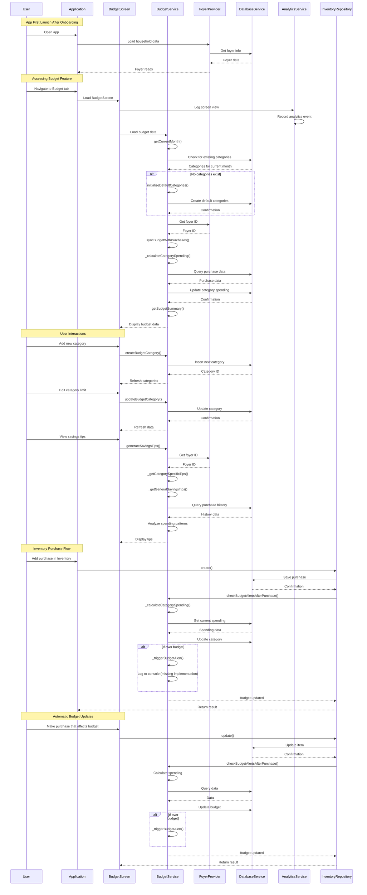

# User Story Flows Analysis

## Overview
This document details the complete user story flows for the sync and budget features in NgoNest, identifying potential gaps in implementation and areas for improvement.

## Improved Sync Feature Flow

For the complete and improved sync flow, please refer to [sync_feature_flow.md](file:///C:/Users/yoann/Documents/School/Xp-X4/Busi/NgoNest/ngonnest/code/flutter/ngonnest_app/docs/sync_feature_flow.md) which contains a detailed sequence diagram and implementation plan.

## Complete User Story Flow: Budget Feature

## Identified Implementation Gaps

### Sync Feature Gaps

1. **Missing Integration in Inventory Operations**:
   - In [inventory_repository.dart](file:///C:/Users/yoann/Documents/School/Xp-X4/Busi/NgoNest/ngonnest/code/flutter/ngonnest_app/lib/repository/inventory_repository.dart), there are calls to `BudgetService.checkBudgetAlertsAfterPurchase()` but no calls to `SyncService.enqueueOperation()` for CRUD operations
   - This means inventory changes are not being queued for synchronization

2. **Incomplete Initial Sync Trigger**:
   - When sync is enabled in [settings_screen.dart](file:///C:/Users/yoann/Documents/School/Xp-X4/Busi/NgoNest/ngonnest/code/flutter/ngonnest_app/lib/screens/settings_screen.dart), there's no automatic trigger for an initial sync
   - The settings screen has a TODO comment about implementing cloud synchronization

3. **Missing User Feedback During Sync**:
   - The [sync_service.dart](file:///C:/Users/yoann/Documents/School/Xp-X4/Busi/NgoNest/ngonnest/code/flutter/ngonnest_app/lib/services/sync_service.dart) has limited user feedback during sync operations
   - Users may not be aware of sync progress or status

### Budget Feature Gaps

1. **Incomplete Budget Alerts Implementation**:
   - In [budget_service.dart](file:///C:/Users/yoann/Documents/School/Xp-X4/Busi/NgoNest/ngonnest/code/flutter/ngonnest_app/lib/services/budget_service.dart), the `_triggerBudgetAlert()` method only logs to console
   - There's a TODO comment to implement `NotificationService.showBudgetAlert` but it's not implemented

2. **Missing Recommended Budgets Initialization**:
   - The `initializeRecommendedBudgets()` method exists but is not integrated into the onboarding or initial setup flow
   - Users don't automatically get personalized budget recommendations

3. **Incomplete Analytics Integration**:
   - While analytics events are logged in [budget_screen.dart](file:///C:/Users/yoann/Documents/School/Xp-X4/Busi/NgoNest/ngonnest/code/flutter/ngonnest_app/lib/screens/budget_screen.dart), not all user actions may be tracked
   - Some interactions might be missing analytics coverage

## Recommendations

1. **Implement Sync Integration in Inventory Repository**:
   - Add calls to `SyncService.enqueueOperation()` in all CRUD methods in [inventory_repository.dart](file:///C:/Users/yoann/Documents/School/Xp-X4/Busi/NgoNest/ngonnest/code/flutter/ngonnest_app/lib/repository/inventory_repository.dart)

2. **Add Initial Sync Trigger**:
   - In [settings_screen.dart](file:///C:/Users/yoann/Documents/School/Xp-X4/Busi/NgoNest/ngonnest/code/flutter/ngonnest_app/lib/screens/settings_screen.dart), trigger an initial sync when sync is enabled

3. **Implement Real Budget Alerts**:
   - Replace console logging with actual user notifications in `_triggerBudgetAlert()` method in [budget_service.dart](file:///C:/Users/yoann/Documents/School/Xp-X4/Busi/NgoNest/ngonnest/code/flutter/ngonnest_app/lib/services/budget_service.dart)

4. **Integrate Recommended Budgets**:
   - Add call to `initializeRecommendedBudgets()` during onboarding or first budget screen access

5. **Enhance User Feedback**:
   - Add progress indicators and more detailed status messages during sync operations